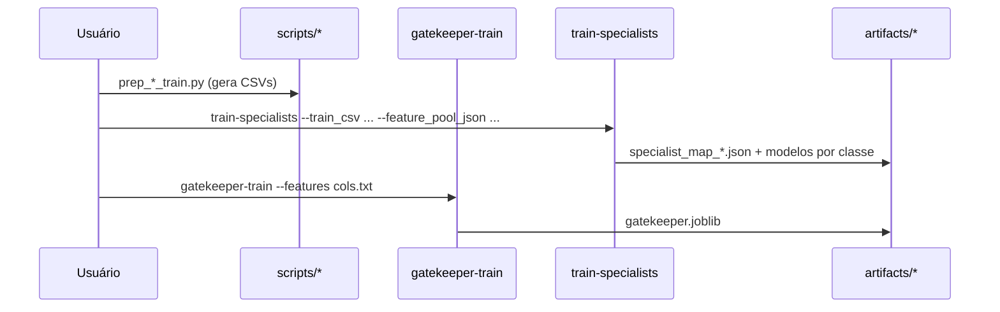
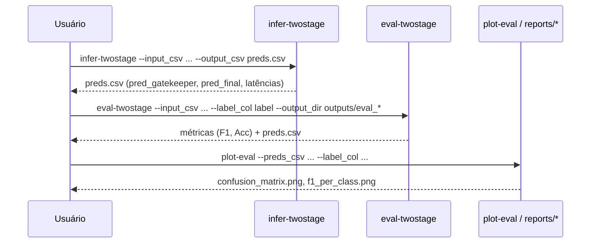

# 2D-AEF — Arquitetura do Projeto

**Versão:** v0.1.0 • **Repositório:** `elcelsius/2D-AEF`

## Visão Geral
O 2D-AEF organiza a detecção de intrusão em **dois estágios**:
1) **Gatekeeper** (filtro rápido): classifica grosso modo o tráfego e direciona;
2) **Especialista por classe**: modelo + conjunto de atributos otimizados para cada classe.

### Diagrama (alto nível)
```mermaid
flowchart LR
    A[Dados brutos (UNSW, CIC, ...)] --> B[Ingestão / ETL]
    B --> C[(Feature Pool<br/>artifacts/feature_pool_*.json)]
    B --> D[Gatekeeper Train<br/>artifacts/gatekeeper_*.joblib]
    C --> E[Treinar Especialistas por Classe<br/>artifacts/specialists_*/*/model.joblib]
    D --> F[Gatekeeper (.joblib)]
    E --> G[(Mapa de Especialistas<br/>artifacts/specialist_map_*.json)]
    I[CSV para inferência<br/>data/*_infer.csv ou *_eval.csv] --> J[Inferência 2 estágios<br/>infer-twostage]
    F --> J
    G --> J
    J --> K[Predições (preds.csv) + métricas]
    J --> L[XAI (SHAP / LIME)]
    K --> M[Plots / Relatórios<br/>plot-eval → confusion_matrix.png, f1_per_class.png]
    L --> N[Consolidação XAI<br/>aggregate-xai → _consolidado/]
```

## Estrutura do Repositório (resumo)
```
src/twodaef/
  features/           # seleção/pool de atributos
  specialists/        # treino dos especialistas por classe
  infer/              # two-stage inference
  eval/               # avaliação + métricas
  reports/            # plots, agregação XAI
  xai/                # SHAP/LIME
  cli_*.py            # CLIs (entry points)

scripts/              # utilitários (download/prep/cols)
reports/              # relatórios finais (.md, imagens)
artifacts/            # modelos/feature-pools/mapas (json/joblib)
data/                 # dados locais (ignorado no Git)
```

## Fluxo de Treino (UNSW/CIC)


## Fluxo de Inferência e Avaliação


## Principais Componentes
- **Feature Pool** (`cli_make_feature_pool`): gera subconjuntos de atributos (heurísticas/pesquisas).
- **Especialistas** (`train-specialists`): escolhe, por classe, o melhor par *modelo + feature set* (F1_k/latência).
- **Gatekeeper** (`gatekeeper-train`): árvore podada simples, rápida, com colunas controladas por arquivo `.txt`.
- **Inferência** (`infer-twostage`): aplica Gatekeeper → escolhe Especialista da classe → pred_final.
- **Avaliação** (`eval-twostage`, `plot-eval`): recomputa métricas/plots.
- **XAI** (`explain-specialist`, `aggregate-xai`): SHAP/LIME por classe + consolidação.

## Convenções de Caminho / IO
- **Windows PowerShell** com barras `\` aceitas nos CLIs.
- Arquivos grandes (dados/outputs) são ignorados no Git via `.gitignore`.
- Artefatos versionáveis leves: `artifacts/*.(json|md)` podem ser comitados.

## Entrypoints (atalhos)
- `gatekeeper-train`, `train-specialists`, `infer-twostage`, `eval-twostage`, `plot-eval`,
  `explain-specialist`, `aggregate-xai`.

## Roadmap (alto nível)
- CIC-IDS2018 completo ✅
- UNSW-NB15 MVP ✅
- Comparação boosters por classe (exp #2)
- Hardening de paths no Windows (bug #3) — em andamento
- MLOps básico (tracking + reproducibility) — próximo

---
_Este documento é gerado manualmente. Atualize junto com mudanças de CLI ou estrutura._
