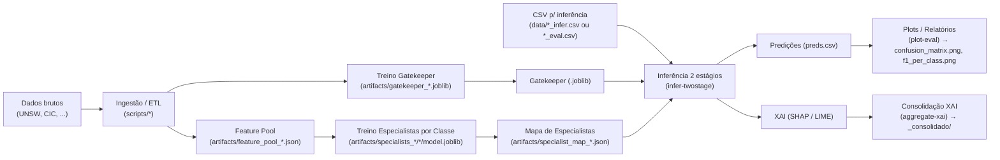
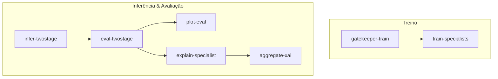

# 2D-AEF — Arquitetura do Projeto
**Versão:** v0.1.0

Repositório: [elcelsius/2D-AEF](https://github.com/elcelsius/2D-AEF)

---

## Visão Geral

O 2D-AEF organiza a detecção de intrusão em **dois estágios**:

- **Gatekeeper (filtro rápido):** classifica grosso modo o tráfego e direciona;
- **Especialista por classe:** modelo + conjunto de atributos otimizados para cada classe.

---

## Diagrama (alto nível)

> Dica: no GitHub, mantenha as crases do bloco *Mermaid* exatamente como abaixo.



---

## Componentes

- **ETL / Scripts** (`scripts/`): preparo dos CSVs de treino/avaliação e listas de colunas do Gatekeeper.
- **Gatekeeper** (`artifacts/gatekeeper_*.joblib`): classificador rápido para roteamento.
- **Especialistas** (`artifacts/specialists_*/*/model.joblib`): um modelo otimizado por classe.
- **Mapa de Especialistas** (`artifacts/specialist_map_*.json`): liga classe → (modelo, features).
- **Inferência 2 estágios**: combina Gatekeeper + Especialista para gerar `preds.csv`.
- **Relatórios/Plots** (`reports/` e `outputs/`): gráficos, métricas e XAI consolidados.

---

## CLI (pontos de entrada)



---

## Layout de Pastas (essencial)

```
2D-AEF/
├─ scripts/                         # ETL/auxiliares
├─ src/twodaef/                     # código-fonte (CLI + libs)
│  ├─ eval/ reports/ xai/ ...
├─ artifacts/                       # modelos & mapas (pesados ignorados no git)
│  ├─ gatekeeper_*.joblib
│  ├─ specialists_*/*/model.joblib
│  └─ specialist_map_*.json
├─ data/                            # dados brutos/derivados (ignorado no git)
├─ outputs/                         # resultados (plots, preds, xai) (ignorado no git)
├─ reports/                         # relatórios em Markdown/figuras
├─ README.md  pyproject.toml  requirements.txt  .gitignore
```

---

## Notas de Renderização (Mermaid no GitHub)

- Use bloco cercado com **três crases** e a linguagem `mermaid` na primeira linha.
- Não cole linhas de Mermaid fora do bloco de código.
- Evite caracteres especiais fora de aspas nos rótulos; quando necessário, use `"` e quebras de linha com `<br/>`.
- Se aparecer *Unable to render rich display*, verifique se **toda** a seção do diagrama está dentro do bloco cercado.
